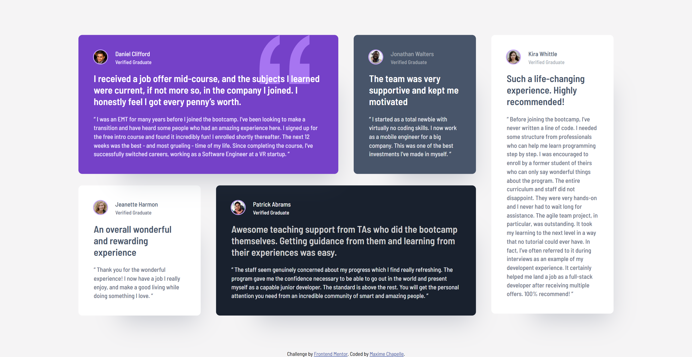

# Frontend Mentor - Testimonials grid section solution

This is a solution to the [Testimonials grid section challenge on Frontend Mentor](https://www.frontendmentor.io/challenges/testimonials-grid-section-Nnw6J7Un7). Frontend Mentor challenges help you improve your coding skills by building realistic projects.

## Table of contents

- [Overview](#overview)
  - [The challenge](#the-challenge)
  - [Screenshot](#screenshot)
  - [Links](#links)
- [My process](#my-process)
  - [Built with](#built-with)
  - [What I learned](#what-i-learned)
  - [Continued development](#continued-development)
  - [Useful resources](#useful-resources)
  - [AI Collaboration](#ai-collaboration)
- [Author](#author)
- [Acknowledgments](#acknowledgments)

## Overview

### The challenge

Users should be able to:

- View the optimal layout for the site depending on their device's screen size

### Screenshot



### Links

- Solution URL: [Add solution URL here]
- Live Site URL: [https://maxi1993-tech.github.io/testimonials-grid-section/](https://maxi1993-tech.github.io/testimonials-grid-section/)

## My process

### Built with

- Semantic HTML5
- CSS variables
- SCSS
- CSS Grid
- Mobile-first workflow

### What I learned

I learned to use `grid-column` and `grid-row` to control card placement precisely in a CSS Grid layout.

```css
.card-five {
  grid-column: 4 / 5;
  grid-row: 1 / 3;
}
```

I also discovered the difference between `border` (inside the box) and `outline` (outside the box) — useful for avatar rings that shouldn't affect layout.

```css
img {
  outline: 2px solid hsl(264, 82%, 80%);
}
```

### Continued development

I want to keep practising Grid and Flexbox until I naturally choose the right approach. Same for SCSS. I also want to keep improving my semantic HTML and find better working habits for structuring code.

### Useful resources

- [MDN](https://developer.mozilla.org/en-US/) - For CSS documentation.
- [Layoutit Grid](https://grid.layoutit.com/) - To visualize and build the grid before coding it.

### AI Collaboration

I used Claude as a guide — it asked questions rather than giving answers directly.

## Author

- Frontend Mentor - [@maxi1993-tech](https://www.frontendmentor.io/profile/maxi1993-tech)
- GitHub - [@maxi1993-tech](https://github.com/maxi1993-tech)

## Acknowledgments

Thanks to Frontend Mentor for this challenge. It's my first Junior-level project and it was a great learning experience.